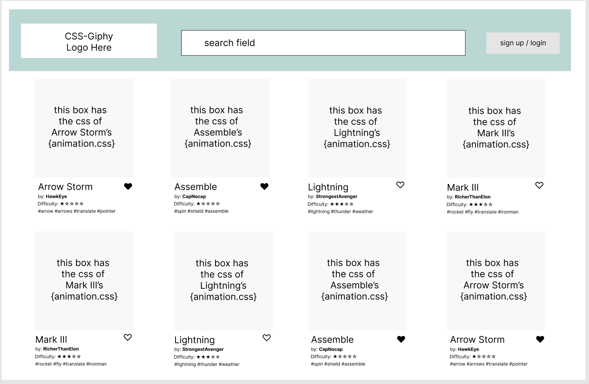
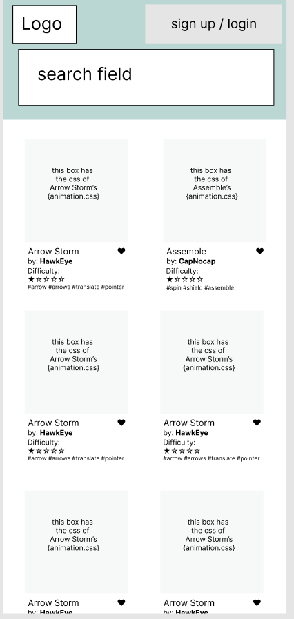
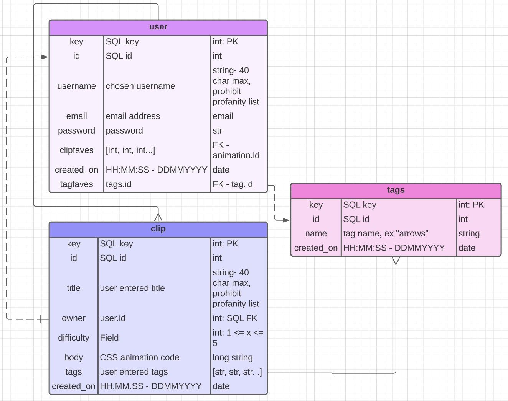

# CSS-Clips

An app where users can view a database of user created CSS animations in a grid display.
(Giphy, for CSS animations.)

## the TL;DR

-   Tech Stack
    -   Django
    -   Python
    -   SQL
-   Viewable, searchable database of user submitted CSS animations

## MVP Goals

-   grid of window frames that each display a simple CSS animation
-   each CSS clip renders on its own detail page
-   full CRUD for user's own clips
-   each animation has tags
-   search bar
    -   can search by clip title
-   basic Bulma styling for site

## Stretch Goals

-   Many to Many relationship (tags -> clips)
-   Search Bar allows search by clip title AND tag
-   smooth looking Bulma styling for site
-   query results page displays grid of many divs w/ CSS animations happening at once (like Giphy)
-   "trending" CSS clips on index page
-   user ability to save favorites, view them on user's detail page

## User Stories

My user is someone who wants to discover, create, share small CSS animations. For styling my own pages, I've found a lot of inspiration by seeing cool animations from other sites around the web. But there's no destination to find a LOT of them all at once. I had this vision of a site like Giphy, that displays CSS animations in a way where it's easy to see a lot of them, and then reference the code to learn and adapt it for my own use. I haven't found it. I figured if it was something I was looking for, others must be, too. This is my go at making an easily viewable and searchable CSS animations library.

-   As a user:
    -   I can view a grid of different CSS animations on the home page.
    -   I can search for clips by title via a search bar on the home page.
    -   I can add, edit, delete my own clips.
    -   I can add tags to my clips.
    -   (STRETCH) I can sort clips by difficulty level.
    -   (STRETCH) I can login.
    -   (STRETCH) I can favorite animations.
    -   (STRETCH) I can view clips I've favorited.

## Milestones

### Day 1

-   Create data Models, views, urls in Django
-   Create PostGreSQL db

### Day 2

-   Generate seed data
-   seed DB (moved to day 5)
-   add auth to site

### Day 3

-   Add Tags to Clips (AKA user posts)

### Day 4

-   add env control for Django
-   Deploy app on Heroku
-   Add comments throughout code
-   Get Tags to filter correctly in Tag Detail route
-   Style all Forms
    -   Sign Up
    -   Create Clip
        -   change Tags field into clickable boxes
    -   Update Clip
        -   change Tags field into clickable boxes
-   Styling, bug squashing

### Day 5

-   additional styling, stretch goals
-   Generate Clips for the DB
    -   include as file in repo for people who Fork to quick seed the db for testing
-   Add deployed site to Personal Portfolio
-   Add to Resume
-   Post screenshots of deployed project on LinkedIn

## Initial Wireframes

### Desktop Wireframe

### Mobile Wireframe

### Figma Link

[CSS Clips on Figma](https://www.figma.com/file/g76YgWIyT3rpwRORYhhRxl/CSSclips?node-id=0%3A1&t=CbeFnI6NZkVwaiTI-1 "Figma")

## ERD

MVP will have a 1-many relationship (User -> Posts)
Stretch will include auth for multiple users, as well as tags, introducting Many-Many relationships (Users -> Posts, Posts -> Tags)

### Lucid ERD link

[CSS Clips on Lucid ERD](https://lucid.app/lucidchart/5f8c4e99-2a6d-4141-9767-383d972d3539/edit?viewport_loc=-133%2C181%2C1936%2C1024%2C0_0&invitationId=inv_b147fe33-04b3-4390-87c7-63998297fbd9, "Lucid ERD")
