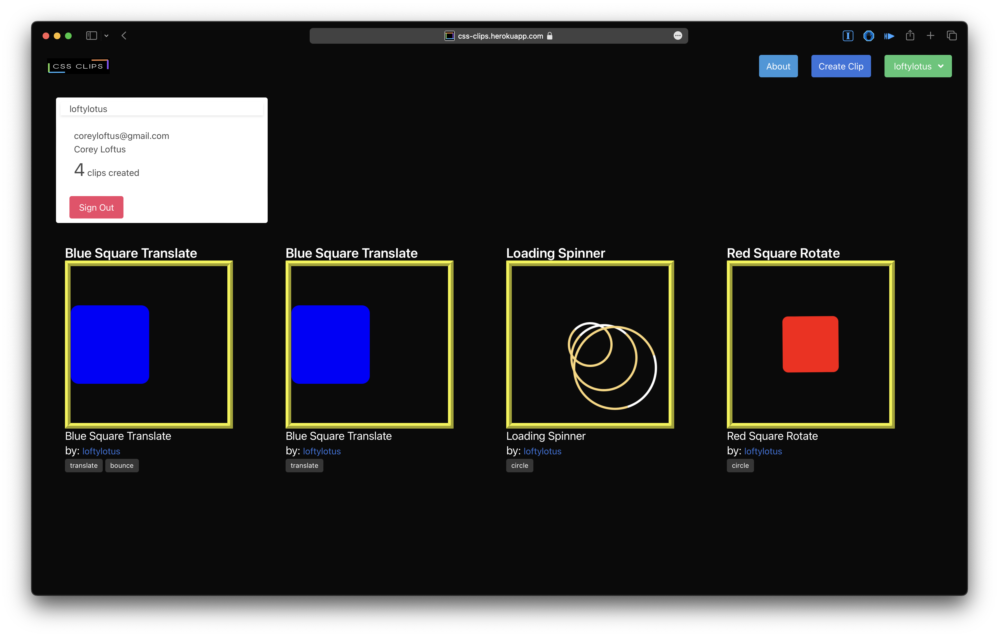

# CSS Clips

CSS Clips is an app where users can view a database of user created CSS animations in a grid display.
You might think of it as a library of simple CSS animation clips.

I was inspired to create this project when I was looking for simple CSS animations I might include in my own portfolio website. Of course, there's Codepen, but most of the animations on there are super complex, and not vanilla HTML/CSS. And of course, there's Giphy, but I wanted HTML/CSS animations, not GIFs. There had to be somewhere to view a bunch of CSS clips at once... right? I couldn't find one. I realized that if it didn't exist, I would have to create it.

I'm pleased to introduce you to my own personal library of CSS Clips. I'd be honored if you'd contribute to it, and make it yours, as well.

~ C

## Screenshots
Index Page of all clips

Detail Page 
(displaying one clip, and its code | check out the responsive styling)

User Profile page
(only clips made by the user you are viewing will show up on their profile page)

## Links

-   [Repo](https://github.com/coreyloftus/css-giphy/edit/main/readme.md "Repo")

-   [Bugs](https://github.com/coreyloftus/css-giphy/issues "Issues Page")

-   [Wireframes](https://www.figma.com/file/g76YgWIyT3rpwRORYhhRxl/CSSclips?node-id=0%3A1&t=CbeFnI6NZkVwaiTI-1 "Figma Wireframes")

-   [ERD](https://lucid.app/lucidchart/5f8c4e99-2a6d-4141-9767-383d972d3539/edit?viewport_loc=-133%2C181%2C1936%2C1024%2C0_0&invitationId=inv_b147fe33-04b3-4390-87c7-63998297fbd9, "Lucid ERD")

## How to Install and Run the Project

You must have a virtual environment setup to run this project locally. This project is made with Django/Python, so it uses the Python package manager Pip. If you're using Pip...

In the project directory, you can run:

### `pipenv shell`

to launch your virtual environment.

Next, run:

### `python3 manage.py runserver`

Then, navigate to:

### `http://localhost:8000`

You should see the homepage of the app appear.

Create your first clip, and you're up and running.

## How to Use the Project

You might either: use the live hosted site, or clone down and create your own instance...
as a way to keep your own library of cool, simple CSS animations for future reference.
If using my hosted site, please keep it classy.

## Credits

Many thanks to for all coders who have come before, who made this tech stack possible.

Specific thanks to:

-   the Instructional Team for General Assembly's SEI 10-31-22
-   my fellow cohort members from SEI 10-31-22, for your support and friendship
-   The Django Team
-   The Python Team
-   The Bulma Team
-   Giphy and CodePen, for making awesome apps that inspired this one, here

## How to Contribute to the Project

You might:

-   Take a look at the issues page, and tackle one, yourself.
-   Submit a new issue.
-   Visit the live site, create a username, and add a Clip.
-   Clone down the repo, and make it your own.

## Built With

-   Django
-   Python
-   HTML
-   Bulma
-   CSS

## Future Updates

-   [ ] Add "Favorite" functionality -- user can add a clip to their favorites, view favorites on their profile or via link on navbar dropdown (visible while logged in)
-   [ ] Add Search bar to index page
-   [ ] Add ability for Tags to be created by users when posting a clip
-   [ ] Incorporate Django bleach package to prevent malicious users from submitting code that corrupts/crashes the app

## Author

**Corey Loftus**

-   [Profile](https://github.com/coreyloftus "Corey Loftus")
-   [Email](mailto:coreyloftus@gmail.com?subject=Hi "Hi there!")
-   [Website](https://corey-loftus.netlify.app "My Portfolio")

## 🤝 Support

Contributions, issues, and feature requests are welcome!

Give a ⭐️ if you like this project!
